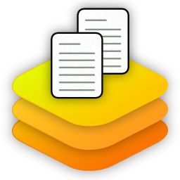

# Duplicate File Cleaner ++

Detects and Recovers disk space used by duplicate files of any type, anywhere. 

Duplicate files are everywhere; sometime you make a copy, save somewhere else, or just backup some files and forget about them. They all take up valuable disk space; but which ones to delete ? Even if you think you know which ones to delete; it take time and experience to go through your disk tidying up. 

Meet Duplicate File Cleaner ++, the easiest way to automate the whole process; saves you time, and becomes a constant companion, always on the lookout for you.

It's so easy..
1. Select where you want searching (using pre-defined folders, drives, or select your own).
2. Intelligent auto-selection of duplicates (or not, your choice).
3. View the results and recycle the duplicates .

Features..
- Duplicates are:-
  - Filtered for easy selection (All Duplicates, Pictures, Movies, Music, Documents, Archives, and Other).
  - Grouped and Sorted so you can focus on where the most disk space is being taken.
- Detects files that have been renamed, had their file type changed, or copied across folders or drives. 
- Intelligent Auto-Select uses over 15 rules to determine which, of a group of identical files, is the original and which should be selected for deletion.

Native 64-bit for Intel, AMD, and ARM computers.

# Get it Here

https://www.microsoft.com/store/apps/9P84PVC1JL0L

# Screen Shots

